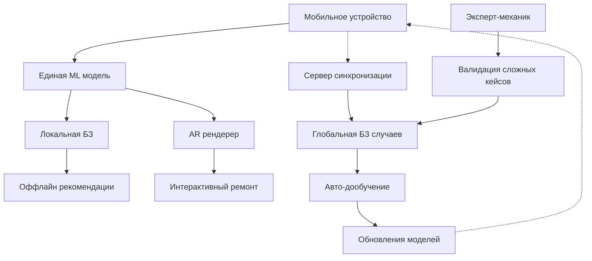

# **Архитектура AI-платформы для автомобильной диагностики: радикальный подход**

## **Фундаментальные принципы**

**1. Data-First Architecture**
- Система проектируется вокруг данных, а не функциональности
- Каждый диагностический случай — это уникальный data point
- Все данные структурированы для немедленного использования в ML

**2. Edge-Native Approach**
- Вся обработка на устройстве пользователя
- Сервер — только для синхронизации и сложных вычислений
- Оффлайн-работа как основной сценарий

**3. Continuous Learning Loop**
- Каждое использование улучшает систему
- Автоматическое дообучение на новых данных
- Пользователи — неявные анотаторы данных

## **Технологический стек нового поколения**

### **Мобильная платформа:**
```python
# Не React Native, а нативный фреймворк
- SwiftUI + CoreML (iOS)
- Jetpack Compose + ML Kit (Android) 
- On-device модели <50MB
- Local vector database для быстрого поиска
```

### **AI Core:**
```python
# Единая мультимодальная модель вместо отдельных
- Transformer-based architecture
- Единое embedding-пространство для:
  - Изображений компонентов
  - Аудио спектрограмм  
  - Текстовых описаний
  - Кодов ошибок
- Knowledge distillation от экспертных моделей
```

### **Бэкенд как координатор:**
```python
# Минималистичный бэкенд
- Python + FastAPI (только для тяжелых вычислений)
- Redis как distributed cache
- TimescaleDB для временных рядов
- Weaviate для векторного поиска по глобальной БЗ
- Celery для асинхронных задач переобучения
```

## **Архитектурная схема**



## **Ключевые инновации**

### **1. Self-Improving System**
```python
class DiagnosticSystem:
    def process_case(self, images, audio, user_feedback):
        # Локальная диагностика
        diagnosis = self.local_model.predict(images, audio)
        
        # Отправка анонимизированных данных
        if user_confirms_correct:
            self.sync_improvement_case(diagnosis, images, audio)
        
        # Получение улучшенных моделей
        self.check_for_model_updates()
```

### **2. Adaptive Interface**
- Интерфейс подстраивается под уровень экспертизы пользователя
- Для новичка: пошаговые AR-инструкции
- Для эксперта: сырые данные и продвинутые метрики
- Для механика: инструменты разметки и валидации

### **3. Distributed Knowledge Graph**
- Каждое устройство содержит релевантный subset знаний
- Graph RAG для контекстного поиска решений
- Automatic knowledge distillation от экспертов к пользователям

## **Этапы реализации**

### **Phase 1: Foundation (6 недель)**
```python
# Минимальный жизнеспособный продукт
- Базовая CV модель (5 компонентов)
- Локальная база 50 частых проблем
- Оффлайн AR инструкции для 3 сценариев
- Система сбора feedback
```

### **Phase 2: Network Effects (8 недель)**
```python
# Механизмы сетевого эффекта
- P2P обновления моделей
- Reputation system для экспертов
- Automatic case clustering
- Distributed training pipeline
```

### **Phase 3: Autonomy (6 недель)**
```python
# Самообучающаяся система
- Continuous learning loop
- Automated quality validation
- Adaptive interface personalization
- Predictive maintenance models
```

## **Преимущества подхода**

**1. Масштабируемость**
- 1 пользователь или 1 миллион — архитектура одинакова
- Стоимость обслуживания практически не растет

**2. Устойчивость**
- Работа без интернета
- Защита от серверных сбоев
- Локальная приватность данных

**3. Скорость развития**
- Каждый пользователь улучшает систему
- Экспоненциальный рост качества диагностики
- Автоматическое обнаружение новых паттернов

## **Коммерческая модель**

```python
# Бесплатно:
- Базовая диагностика
- Доступ к сообществу

# Премиум (подписка):
- Расширенная БЗ
- Приоритетные обновления
- Персональные рекомендации

# Enterprise:
- White-label решение для СТО
- Кастомные модели под марку
- Analytics и прогнозная аналитика
```

## **Технические риски и решения**

**Риск:** Качество начальных данных
**Решение:** Active learning + экспертная валидация сложных случаев

**Риск:** Производительность на слабых устройствах  
**Решение:** Knowledge distillation + progressive model loading

**Риск:** Сложность мультимодальных моделей
**Решение:** Modular transformers + cross-attention механизмы

## **Заключение**

Эта архитектура превращает диагностическую систему из статического инструмента в живую, развивающуюся экосистему. Каждый пользователь становится частью системы улучшения, а технологический стек обеспечивает беспрецедентную масштабируемость и отказоустойчивость.

**Ключевая метафора:** Это не приложение для диагностики, а распределенный мозг автомобильного сообщества, где каждый участник вносит свой вклад в общий интеллект.
