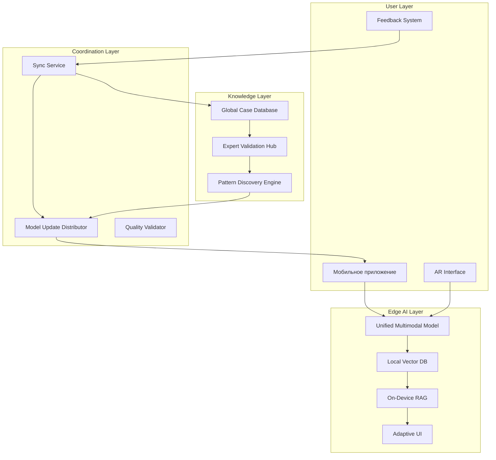
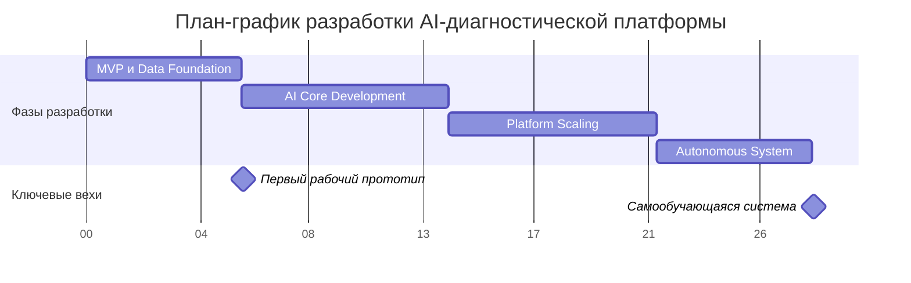

# **Техническое предложение по разработке AI-платформы для автоматизированной диагностики автомобилей**

## **Резюме проекта**

Создание распределенной AI-экосистемы для диагностики автомобилей, сочетающей передовые технологии компьютерного зрения, обработки звука и машинного обучения с практической экспертизой автомобильных механиков. Система построена по принципу "edge-first" с непрерывным самообучением на данных пользователей.

---

## **1. Фундаментальная архитектура**

### **Принципы проектирования:**
- **Data-Centric Approach**: Система проектируется вокруг данных диагностических случаев
- **Edge-Native**: Основная обработка на мобильных устройствах, сервер как координатор
- **Continuous Learning**: Каждое использование улучшает систему через обратную связь
- **Multimodal Fusion**: Единое пространство для изображений, звуков, текстовых описаний

### **Технологический стек:**

**Мобильная платформа (On-Device):**
- iOS: SwiftUI + CoreML + ARKit
- Android: Jetpack Compose + ML Kit + ARCore  
- Локальная векторная БД (SQLite + векторизация)
- Размер моделей: <80MB для обеспечения качества

**AI Core:**
- **Унифицированная трансформер-архитектура** для мультимодальных данных
- YOLOv8 (CV) + Wav2Vec2 (аудио) + BERT (текст) с общим embedding-пространством
- Local LLM (Phi-3, Gemma 2B) для RAG-поиска в локальной БЗ
- Automatic knowledge distillation от экспертов

**Бэкенд-координатор:**
- Python FastAPI + WebSockets для реального времени
- TimescaleDB - временные ряды диагностических данных
- Weaviate - векторное хранилище глобальной базы знаний
- Redis - распределенный кэш и сессии
- Celery - асинхронное переобучение моделей

**Инфраструктура:**
- Kubernetes + Docker
- Yandex Cloud (импортозамещение) с GPU-нодами
- CDN для распространения обновлений моделей
- MLflow + Kubeflow для MLOps

---

## **2. Детальный план реализации**

### **Этап 1: MVP и Data Foundation (6 недель)**
```python
# Цель: Рабочий прототип для 3 сценариев
- CV: Распознавание аккумулятора, щупа масла, воздушного фильтра
- Аудио: Детекция стука двигателя, свиста ремней  
- База: 100+ частых проблем с пошаговыми инструкциями
- AR: Basic overlay для замены воздушного фильтра
```

**Задачи:**
- Сбор и разметка 1000+ изображений компонентов
- Запись 500+ аудиодорожек типовых неисправностей  
- Разработка мобильного приложения с оффлайн-работой
- Система сбора пользовательского feedback

### **Этап 2: AI Core Development (8 недель)**
```python
# Цель: Единая мультимодальная модель
- Трансформер-архитектура с cross-attention
- Общее embedding-пространство для всех модальностей
- Knowledge distillation от узких экспертных моделей
- Оптимизация для мобильных устройств (TFLite, CoreML)
```

**Задачи:**
- Обучение unified transformer модели
- Разработка механизмов fusion для CV+аудио+текст
- Создание локальной RAG-системы на устройстве
- Система автоматической валидации экспертом

### **Этап 3: Platform Scaling (8 недель)**
```python
# Цель: Сетевые эффекты и сообщество
- P2P обмен диагностическими случаями
- Reputation system для экспертов-механиков
- Automatic case clustering и выявление новых паттернов
- Distributed training pipeline
```

**Задачи:**
- Механизмы синхронизации между устройствами
- Система репутации и мотивации экспертов
- Инструменты для краудсорсинга разметки данных
- Дашборды аналитики для СТО

### **Этап 4: Autonomous System (6 недель)**
```python
# Цель: Самообучающаяся экосистема
- Continuous learning loop
- Automated A/B testing моделей
- Predictive maintenance модели
- Adaptive personalization интерфейса
```

---

## **3. Архитектурная схема системы**



---

## **4. Смета и план-график**

### **Детализированная смета:**

| Компонент | Трудозатраты | Стоимость | Примечания |
|-----------|--------------|-----------|------------|
| **Мобильная разработка** | 400 часов | 560 000 ₽ | Нативная (Swift+Kotlin) |
| **AI/ML разработка** | 500 часов | 750 000 ₽ | Трансформеры, обучение, оптимизация |
| **Бэкенд-платформа** | 300 часов | 360 000 ₽ | Микросервисы, синхронизация |
| **Data Engineering** | 200 часов | 240 000 ₽ | Пайплайны данных, разметка |
| **Инфраструктура** | 100 часов | 120 000 ₽ | k8s, мониторинг, CDN |
| **Тестирование** | 150 часов | 135 000 ₽ | QA, нагрузочное тестирование |
| **Итого** | **1650 часов** | **2,165,000 ₽** | |

**Инфраструктурные расходы:**
- Cloud + GPU: 35 000 ₽/мес
- ML модели API: 15 000 ₽/мес  
- CDN + хранилище: 8 000 ₽/мес

### **План-график (28 недель):**



---

## **5. Управление рисками**

### **Технические риски:**
| Риск | Вероятность | Влияние | Стратегия |
|------|-------------|---------|-----------|
| Качество мультимодальной модели | Высокая | Критическое | Progressive enhancement, фолбэк на экспертные модели |
| Производительность на weak devices | Средняя | Высокое | Model quantization, progressive loading |
| Синхронизация распределенных данных | Высокая | Высокое | Conflict-free replicated data types (CRDT) |

### **Бизнес-риски:**
| Риск | Митигация |
|------|-----------|
| Медленный сетевой эффект | Gamification, monetization для экспертов |
| Конкуренция со стороны автопроизводителей | Фокус на универсальность и сообщество |
| Юридические вопросы диагностики | Дисклеймеры, партнерства с сертифицированными СТО |

---

## **6. Коммерческая модель и роадмап**

### **Monetization Strategy:**
- **Freemium**: Базовая диагностика + сообщество
- **Pro подписка** (790 ₽/мес): Расширенная БЗ, приоритетные обновления, персональные рекомендации
- **Enterprise** (15 000 ₽/мес): White-label для СТО, кастомные модели, аналитика
- **Expert Marketplace**: Комиссия с консультаций через платформу

### **Роадмап развития:**
- **Год 1**: Захват DIY-рынка, 50K+ пользователей
- **Год 2**: B2B экспансия, партнерства с СТО
- **Год 3**: Интеграции с автопроизводителями, прогнозный maintenance
- **Год 4**: Стандарт де-факто в автомобильной диагностике

---

## **7. Метрики успеха**

### **Технические метрики:**
- Точность диагностики: >90% для 100+ частых случаев
- Время ответа: <3 секунд на устройстве
- Оффлайн покрытие: 85% типовых сценариев
- Размер моделей: <80MB на устройстве

### **Бизнес-метрики:**
- Monthly Active Users: 50K+ к концу года 1
- Retention rate: >45% через 3 месяца
- Expert community: 500+ валидированных механиков
- Customer LTV: >5 000 ₽

---

## **Заключение**

Предлагаемая архитектура создает не просто приложение, а живую экосистему, где каждый участник — от начинающего автолюбителя до опытного механика — вносит вклад в общий интеллект системы. 

**Ключевое преимущество**: Система становится умнее с каждым использованием, создавая непреодолимый барьер для конкурентов и обеспечивая экспоненциальный рост ценности для пользователей.

Техническая реализация основана на современных подходах distributed AI и edge computing, что обеспечивает масштабируемость, отказоустойчивость и превосходный пользовательский опыт.
